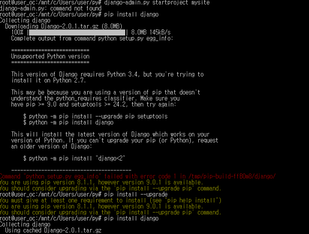
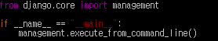
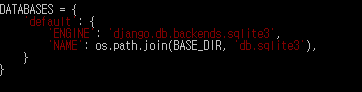
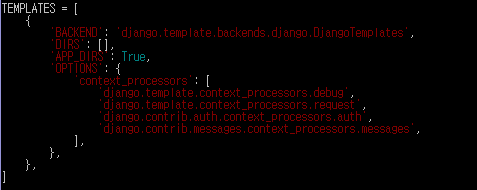
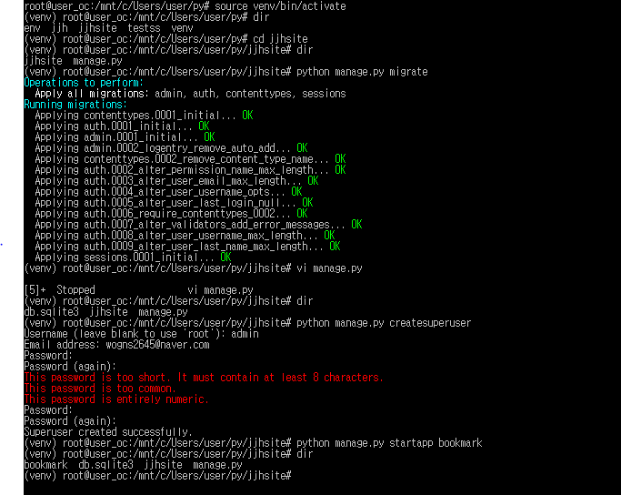
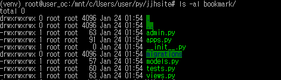
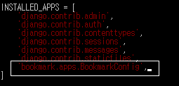

### 실전 프로그램 개발 - Bookmark
1. 프로젝트 생성  
`pip install --upgrade`
 - 버전이 낮을 시 업그레이드 설치 하라는 오류 메세지
 >  
프로젝트를 생성하기전 가상 환경 사용  
`source venv/bin/activate` ( 비활성화 : `deactivate` )  
 - 가상환경 활성화  
`pip install django`  
 - PIP 파이썬으로 작성된 패키지를 설치,관리하는 시스템  
`django-admin.py startproject jjhsite`  
>  
 - jjhsite 디렉토리로 프로젝트를 만듬  
>  
>  
2. 파일 분석
프로젝트 설정 파일인 settings.py 파일에 필요한 사항을 지정합니다  
 1. 장고는 디폴트로 SQLite3 데이터베이스 엔진을 사용하도록 설정됨  
  - SQLite3 : 독립적이고 서버가 불필요하며,설정도 필요없고 트랜잭션을 지원함  
  - 트랜잭션 : 데이터베이스의 상태를 변화시키기 위해 수행하는 작업의 단위 ( SQL를 이용해 데이터베이스 접근하는 것 )  
  MySQL이나 Oracle 다른 데이터 베이스 변경시 파일 수정  
  >  
 2. 템플릿 관련 사항도 확인합니다. DIRS 항목은 프로젝트 템플릿 파일이 위치한 디렉터리를 지정합니다.  
    템플릿 파일을 파일을 찾을, 프로젝트 템플릿 디렉터리는 애플리케이션 템플릿 디렉터리보다 먼저 검색합니다.    
    - 책 4장의 예제부터 항목을 사용  
    >  
 3. 정적 파일에 관한 설정. STATIC_URL항목은 최초 settings.py 파일이 만들어질때 지정해준 그대로이고, STATICFILES_DIRS항목은 프로젝트 정적  
    파일이 위치한 디렉터리를 의미하는데 수동으로 직접 지정합니다.
    ```bash
    STATIC_URL = '/static/'
    ```  
    - 책 4장의 예제부터 항목을 사용  
 4. 타임존 지정  
 `TIME_ZONE = 'UTC'`  
  - 최초에는 세계표준시(UTC) -> 한국 시간으로 'Asia/Seoul' 변경  
 5. 미디어 관련 사항을 지정, 이 항목들은 파일 업로드 기능을 개발할 때 필요한 설정  
  `MEDIA_URL = '/media/'`  
  `MEDIA_ROOT = os.path.join(BASE_DIR, 'media')`  
  - 책 10장의 예제부터 항목을 사용  
 6. 개발하고 있는 애플리케이션을 설정파일에 등록  
  `LANGUAGE_CODE = 'en-us'` -> `LANGUAGE_CODE = 'ko-kr`  
  - 한글로 지정하면 Admin사이트의 메뉴 및 설명 등의 화면이 한글로 표시  
3. 기본 테이블 생성  
 `python manage.py migrate`  
 사용자 및 권한 그룹 테이블을 만들어주기 위해서 프로젝트 개발 시작 시점에 이 명령을 실행하는 것입니다.  
 이 명령이 실행되면 디렉터리에 db.sqlite3 파일이 생성됩니다. 
4. 슈퍼유저 생성  
 `python manage.py createsuperuser`  
 명령어를 실행하게되면 이름/이메일/비밀번호를 입력하면 관리자가 생성됩니다.  
5. 애플리케이션 생성  
 `python manage.py startapp bookmark`  
 >  
 >  
6. 애플리케이션 등록  
 프로젝트에 포함되는 애플리케이션들은 모두 설정 파일에 지정되어야 하므로 북마크 앱도 settings.py 파일에 등록해야 합니다.  
 북마크 앱의 설정 클래스는 `'bookmark.apps.BookmarkConfig'`  
 - `vi settings.py`,  
 - (i = insert, ESC + :w = save, :q = close)  
 >  
7. 개발 코딩하기 - 모델  
 모델 작업은 데이터베이스에 테이블을 생성하도록 해주는 작업  
 1. 테이블 정의
 장고에서는 테이블을 하나의 클래스로 정의하고, 테이블의 컬럼은 클래스의 변수로 매핑합니다.  
 테이블 클래스는 django.db.models.Model 클래스 상속받아 정의하고, 각 클래스 변수의 타입도 장고에서 미리 정의해 둔 필드 클래스 사용
 
 
