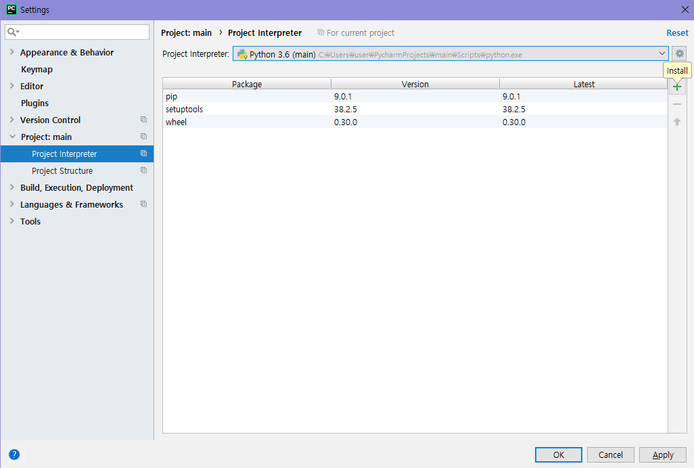
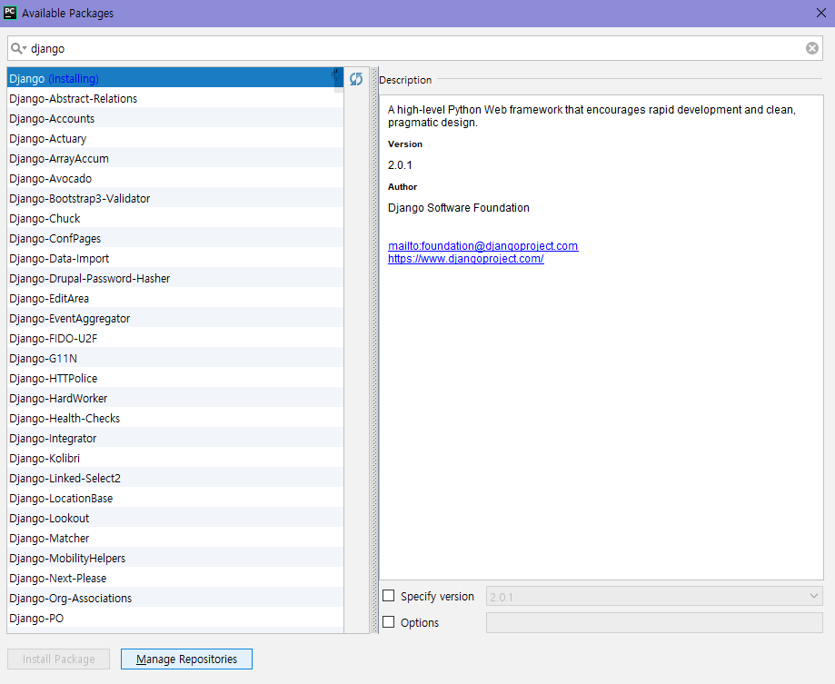
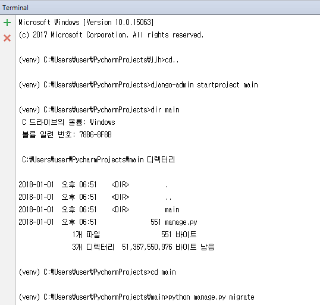
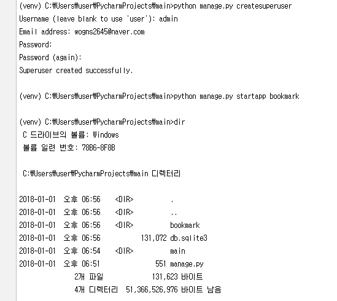
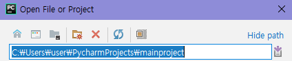
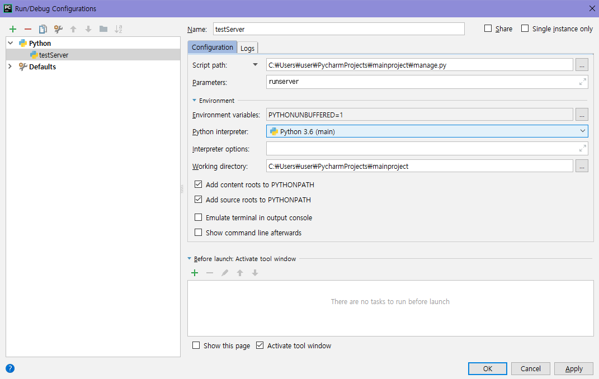
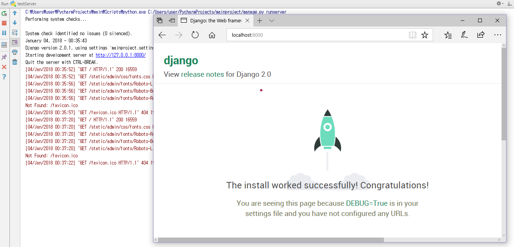

>### 버전
|ITEM|CONTENTS|
|:----|:----|
|Django|version 2.0.1|
|Python|version 3.6.4|
|Windows|Windows 10|

>### 시작하기

1. Django 패키지 설치  
메인창 -> [File] -> [Settings]
>
>

2. 터미널 창에서 Django 프로젝트 뼈대 생성  
단축기 Alt + F12
>
>
-임의로 정한 main 장고 프로젝트 생성  
`django-admin startproject main`  
-데이터베이스 및 User, Group 테이블 생성  
`python manage.py migrate`  
-관리자 계정 생성  
`python manage.py createsuperuser`  
-북마크 앱 생성  
`python manage.py startapp bookmark`  
3. Django 프로젝트 임포트  
[File] -> [Open]
>
4. runserver 실행  
[Run] -> [Edit Configurations]  
(+) 아이콘 -> [Python]
>
>