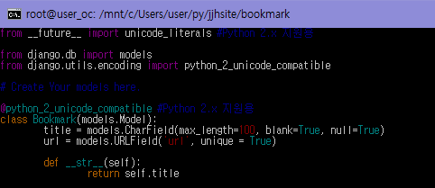
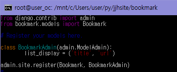
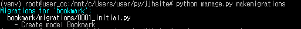
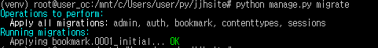
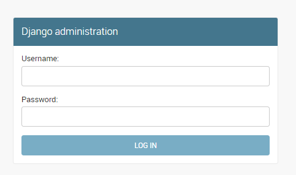
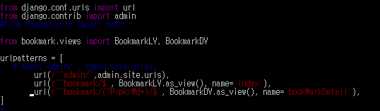
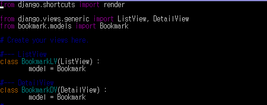
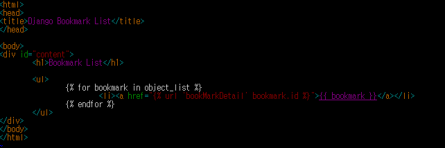
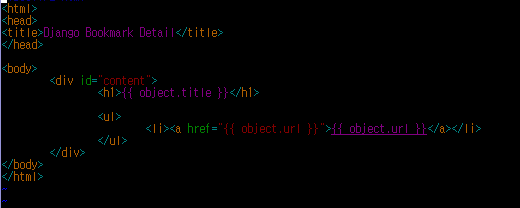

### 실전 프로그램 개발 - Bookmark
1. 프로젝트 생성  
 - 버전이 낮을 시 업그레이드 설치 하라는 오류 메세지  
   
 `pip install --upgrade`  
 - 프로젝트를 생성하기전 가상 환경 사용, 가상환경 활성화
 `source venv/bin/activate` ( 비활성화 : `deactivate` )  
 - PIP 파이썬으로 작성된 패키지를 설치,관리하는 시스템  
 `pip install django`  
 - jjhsite 디렉토리로 프로젝트를 만듬  
 `django-admin.py startproject jjhsite`  
   
   
   
2. 파일 분석 (프로젝트 설정 파일인 settings.py 파일에 필요한 사항을 지정합니다)  
  - 장고는 디폴트로 SQLite3 데이터베이스 엔진을 사용하도록 설정됨  
    * SQLite3 : 독립적이고 서버가 불필요하며,설정도 필요없고 트랜잭션을 지원함  
    * 트랜잭션 : 데이터베이스의 상태를 변화시키기 위해 수행하는 작업의 단위 (SQL를 이용해 데이터베이스 접근하는 것)  
  - MySQL이나 Oracle 다른 데이터 베이스 변경시 파일 수정 ex)mysql  
      
    ```bash
    DATABASES = {
        'default' : {
            'ENGINE' : 'django.db.backends.mysql',
            'NAME':DB,
            'USER':USER,
            'PASSWORD':PW,
            'HOST':0.0.0.0,
            'PORT':3306,
        }
    }
    ```
  - 템플릿 관련 사항도 확인합니다. DIRS 항목은 프로젝트 템플릿 파일이 위치한 디렉터리를 지정합니다.  
    템플릿 파일을 파일을 찾을, 프로젝트 템플릿 디렉터리는 애플리케이션 템플릿 디렉터리보다 먼저 검색합니다.  
    * 책 4장의 예제부터 항목을 사용  
      
  - 정적 파일에 관한 설정. STATIC_URL항목은 최초 settings.py 파일이 만들어질때 지정해준 그대로이고, STATICFILES_DIRS항목은 프로젝트 정적  
    파일이 위치한 디렉터리를 의미하는데 수동으로 직접 지정합니다.  
    ```bash
    STATIC_URL = '/static/'
    ```  
    - 책 4장의 예제부터 항목을 사용  
  - 타임존 지정  
    * `TIME_ZONE = 'UTC'`  
    * 최초에는 세계표준시(UTC) -> 한국 시간으로 'Asia/Seoul' 변경  
  - 미디어 관련 사항을 지정, 이 항목들은 파일 업로드 기능을 개발할 때 필요한 설정  
    `MEDIA_URL = '/media/'`  
    `MEDIA_ROOT = os.path.join(BASE_DIR, 'media')`  
    * 책 10장의 예제부터 항목을 사용  
  - 개발하고 있는 애플리케이션을 설정파일에 등록  
    `LANGUAGE_CODE = 'en-us'` -> `LANGUAGE_CODE = 'ko-kr`  
    한글로 지정하면 Admin사이트의 메뉴 및 설명 등의 화면이 한글로 표시  
3. 기본 테이블 생성  
 사용자 및 권한 그룹 테이블을 만들어주기 위해서 프로젝트 개발 시작 시점에 이 명령을 실행하는 것입니다.  
 이 명령이 실행되면 디렉터리에 db.sqlite3 파일이 생성됩니다.  
 `python manage.py migrate`  
4. 슈퍼유저 생성  
 명령어를 실행하게되면 이름/이메일/비밀번호를 입력하면 관리자가 생성됩니다.  
 `python manage.py createsuperuser`  
5. 애플리케이션 생성  
 `python manage.py startapp bookmark`
   
   
6. 애플리케이션 등록  
 - 프로젝트에 포함되는 애플리케이션들은 모두 설정 파일에 지정되어야 하므로 북마크 앱도 settings.py 파일에 등록해야 합니다.  
 - 북마크 앱의 설정 클래스는 `'bookmark.apps.BookmarkConfig'`  
 - `vi settings.py`,  
 - (i = insert, ESC + :w = save, :q = close)  
   
7. 개발 코딩하기 - 모델  
   모델 작업은 데이터베이스에 테이블을 생성하도록 해주는 작업  
 - 테이블 정의  
   장고에서는 테이블을 하나의 클래스로 정의하고, 테이블의 컬럼은 클래스의 변수로 매핑합니다.  
   테이블 클래스는 django.db.models.Model 클래스 상속받아 정의하고, 각 클래스 변수의 타입도 장고에서 미리 정의해 둔 필드 클래스 사용  
   django에 있는 db모듈에서(from django.db)models라는 모듈을 가져오라는 뜻(import)  
   pytion2/pytion3 호환 방법  
   파이썬2에서는 __unicode__를쓰는데,파이썬3에서는 __str__ 으로 바뀜  
   `@python_2_unicode_compatible`  
   파이썬2에서는 __str__함수가 __unicode__ 변경되어 적용, 파이썬3은 __str__그대로 적용  
   파이썬에서 __은 특별한 메서드라는 뜻, `def __str__(self)` : 문자열화 함수  
   파이썬에서 함수를 정의할 때는 def문을 사용한다. `def` 정의하다라는 뜻의 영어단어 define에서 추린 것
     
 - Admin사이트에 테이블 반영  
     
 - 데이터베이스 변경 사항 반영  
     
     
 - 테이블 모습 확인  
   `python manage.py runserver 0.0.0.0:8000`  
   주소창에 http://localhost:8000/admin/  
     
8. 개발 코딩하기 - URLconf (URL configuration)  
   코딩 순서 urls.py(URL 정의) -> views.py(뷰 로직 작성) -> templates (템플릿 파일작성)  
   1. urls.py  
     
   - 자신이 생성한 jjhsite 라는 디렉토리안에 urls.py을 편집한다. `vi urls.py`  
   - 장고의 내장 함수 url 임포트  
   - `from bookmark.views import BookmarkLV, BookmarkDV`  
     뷰 모듈의 관련 클래스를 임포트, 뒤에서 bookmark/views.py 에서 정의합니다.  
   - `url(r'^admin/', admin.site.urls)` -> 이미 정의된 URLconf를 include() 함수로 가져와서 사용가능  
     `url(r'^admin/',include(admin.site.urls), name)` name은 URL에 이름을 붙인 것으로 뷰를 식별합니다.  
   - 장고는 admin/ 로 시작하는 모든 URL을 view와 대조합니다. 많은 URL이 admin URL에 포함될 수 있어서 정규 표현식을 사용합니다.  
   - django.conf.urls모듈에서 두 개의 함수를 가져옵니다. 이 함수는 URLconf 모듈에 대한 전체 Python을 가져오는데 경로를 포함 할수있게해줍니다.   
   - django.contrib에서 호출하는 함수는 Django 관리 사이트의 URL을 로드하는 함수에 의해 호출됩니다.   
   - r은 정규 표현식 문자열 앞의문자, '^' 패턴이 문자열의 시작과일치해야 함, '$' 패턴이 문자열의 끝에 일치해야 함  
   2. views.py  
     
   - ListView 디폴트 지정 속성 ( 컨텍스트 변수 : object_list, 템플릿 파일 : bookmark_list.html )  
     게시판의 글 목록 전체를 표시하거나, DB테이블의 레코드 전체를 리스트로 표시할 때 활용함  
   - DetailView 특정 글 상세내용 표시 ( 디폴트 컨텍스트 변수명 : object )  
     model에 해당 모델의 특정 레코드를 컨텍스트 변수에 담음  
   3. templates  
   - `cd bookmark/templates/bookmark`  
   - `vi bookmark_list.html`  
   - object_list 객체는 BookmarkLV 클래스형 뷰에서 넘겨주는 파라미터  
   - {{ bookmark }} 템플릿 변수는 Bookmark 테이블의 특정 레코드 하나를 의미합니다. 해당 객체는 models.py의 __str__() 메소드를 호출해 결과를 출력합니다.  
   - urls.py 에서 정의한 url 3번째 인자였던 name의 값이 `<a href="">` '' 안의 텍스트와 매칭됨  
     
     

